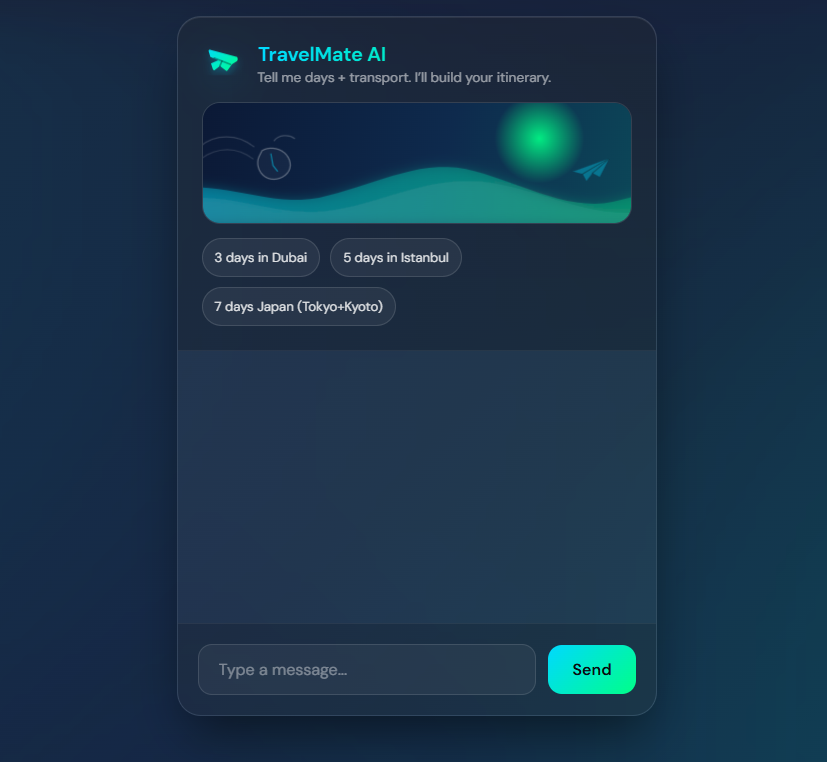

# TravelMate AI (Gemini Travel Itinerary Chatbot)

A modern, animated **travel itinerary assistant** built with **Flask** + the **Gemini API**.  
Describe your destination, number of days, budget, pace, and transport preferences — and the bot will generate a day-by-day plan.

## Preview



## Features

- **AI-powered travel planning** using the Gemini API
- **Clean, modern UI** with gradient background and glassmorphism card
- **Smooth animations** for page load and message bubbles
- **Typing indicator** so users can see when the bot is “thinking”
- **Keyboard-friendly**: press Enter to send messages
- Simple, minimal **Python/Flask** code that is easy to extend

## Tech Stack

- **Backend**: Python, Flask
- **AI**: Gemini API (`gemini-2.0-flash` via `google-genai`)
- **Frontend**: HTML, vanilla JavaScript, CSS (DM Sans, glassmorphism, animations)

## Prerequisites

- Python 3.9+
- A Gemini API key

## Setup

1. **Create environment file**

   In the project root, create a `.env` file and add your API key:

   ```bash
   GEMINI_API_KEY=your_api_key_here
   ```

2. **Install dependencies**

   ```bash
   pip install -r requirements.txt
   ```

## Running the App (Development)

From the project root:

```bash
python app.py
```

The app will start on `http://127.0.0.1:5000`. Open it in your browser and start chatting.

## Production Notes

- Use a proper WSGI server such as **gunicorn** or **uWSGI** (behind Nginx or another reverse proxy) instead of `app.run(debug=True)` for production deployments.
- Set `debug=False` and configure `host`/`port` appropriately when running in production.
- Store your `GEMINI_API_KEY` securely using environment variables or a secrets manager, not committed to source control.
- If you see `RESOURCE_EXHAUSTED` / quota errors, verify your Gemini API plan/billing and rate limits for the project.

## Customization

- **Model**: Change the `model` name in `app.py` (`gemini-2.0-flash`) to another Gemini model that fits your use case and quota.
- **Persona**: Update the system instruction in `app.py` to adjust the assistant’s behavior (trip format, level of detail, constraints, etc.).
- **Styling**: Edit `static/style.css` to tweak colors, animations, spacing, or to add branding for your own product.

## License

This project is provided as a simple reference implementation. Add your preferred license here (e.g., MIT, Apache 2.0) if you plan to publish it.
